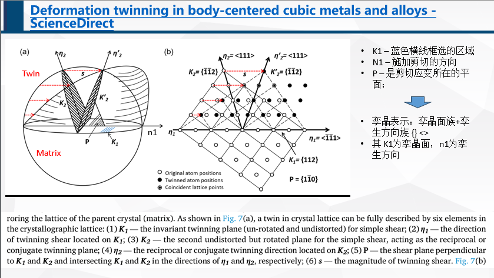

# 孪晶识别帮助文档

本文档旨在详细解释如何使用EBSD数据识别和分析孪晶界。文档分为两大部分：预备知识和MTEX代码的解释。

<!-- 图片保存 in 0-晶体学.pptx -->

## 第一部分：预备知识

### 1. 晶体学基础知识
- **晶体取向**：晶体的取向可以通过Miller指数来定义。Miller指数描述了晶体中特定平面和方向的取向。
  - 晶向指数：描述晶体中特定方向的指数, e.g. (100), (hkl)。
  - 晶面指数：描述晶体中特定平面的指数, e.g. [111], [uvw]。
  - 晶向族{}与晶面族<>

### 2. 孪晶的表示
- **孪晶面**：孪晶面是在晶体中具有特殊排列结构的区域中，两个相邻晶粒之间的界面上的平面。这些平面上的原子排列与晶界处的其他平面不同，通常具有特定的晶体取向关系。{}
- **孪生方向**：孪生方向是孪生发生的方向。<>
 

### 3. 常见的孪晶类型
- **FCC结构的孪晶**：例如{111} <110>。
- **BCC结构的孪晶**：例如{112} <111>。
- **HCP结构的孪晶**：例如{10-12} <10-11>。


### 4. 利用EBSD识别孪晶
> 何通过EBSD数据集来识别孪晶界，并区分共格与非共格孪晶。

- "However, two criteria must be satisfied before a given grain boundary can be strictly considered a coherent twin boundary. First, the misorientation between the crystal lattices separated by the boundary must satisfy a specific misorientation relationship. This criterion had been checked above by using misorientation angle distributions. The second criterion is that the boundary plane separating the two grains must be coincident with a particular twinning plane. This means that for {11-22}<11-2-3> compressive twins and {10-12}<10-1-1> tensile twins, the boundary planes must be aligned with one of the {11-22} and {10-12} plane traces, respectively, in each of the neigh
boring crystals." in [Ref1](https://www.cambridge.org/core/journals/journal-of-materials-research/article/abs/role-of-deformation-twin-on-texture-evolution-in-coldrolled-commercialpurity-ti/C0D2489CB70055CF310545D97A0B5AB0)

- 
## 第二部分：MTEX代码的解释

### 1. EBSD数据的内容
> 介绍EBSD数据中包含的主要信息，如晶粒的取向、相信息、坐标等。

### 2. grainBoundary的数据格式
> 详细说明grainBoundary对象中包含的数据类型和子数据，如晶粒的界面取向差、界面类型等。

### 3. 论坛请教
1. [Inquiry Regarding MTEX's Capability to Recognize Coherent and Incoherent Twin Boundaries](https://github.com/mtex-toolbox/mtex/discussions/2136)
2. 

### 4. 主要晶体结构的twinning代码

```matlab
% HCP of Ti
twinning1 = orientation.byAxisAngle(Miller({1 1 -2 0},ebsd.CS),84.78*degree); % rotation axix and rotation angle
twinning2 = orientation.byAxisAngle(Miller({1 0 -1 0},ebsd.CS),64.62*degree);
twinning3 = orientation.byAxisAngle(Miller({1 0 -1 0},ebsd.CS),35.10*degree);
twinning4 = orientation.byAxisAngle(Miller({1 1 -2 0},ebsd.CS),57.42*degree);

% HCP of Mag
twinning = orientation.map(Miller(0,1,-1,-1,CS),Miller(-1,1,0,-1,CS),...
  Miller(1,0,-1,1,CS,'uvw'),Miller(1,0,-1,-1,CS,'uvw')) % ???

% BCC of Iron fcc
CSL(3,ebsd('Iron fcc').CS) % Sigma3
```
### 4. 模板算例
- **MTEX应用**：提供一些基本的MTEX代码模板，用于演示如何处理EBSD数据以识别和分析孪晶界。

Case 1 of BCC (Iron fcc)
```matlab
% select CSL(3) grain boundaries
gB3 = gB_FeFe(angle(gB_FeFe.misorientation,CSL(3,ebsd('Iron fcc').CS)) < 8.66*degree);
% gb direction in crystal coordinates
gbdirc = inv(grains(gB3.grainId).meanOrientation).*gB3.direction;
% angle between gbdirc and {1,1,1}
MAngle = angle(gbdirc,Miller(1,1,1,ebsd('Iron fcc').CS));
% select only boundaries which have a trend very close to {1,1,1}
GBcoherent = gB3(any(MAngle < 5*degree,2));
% overlay grain boundaries with the existing plot
hold on
plot(gB3,'lineColor','r','linewidth',1.0,'DisplayName','CSL 3');
hold on
plot(GBcoherent,'lineColor','g','linewidth',1.5,'DisplayName','Coherent');
hold off
```

Case 1 of HCP (Iron fcc)
```matlab
% select CSL(3) grain boundaries
gB3 = gB_FeFe(angle(gB_FeFe.misorientation,CSL(3,ebsd('Iron fcc').CS)) < 8.66*degree);
% gb direction in crystal coordinates
gbdirc = inv(grains(gB3.grainId).meanOrientation).*gB3.direction;
% angle between gbdirc and {1,1,1}
MAngle = angle(gbdirc,Miller(1,1,1,ebsd('Iron fcc').CS));
% select only boundaries which have a trend very close to {1,1,1}
GBcoherent = gB3(any(MAngle < 5*degree,2));
% overlay grain boundaries with the existing plot
hold on
plot(gB3,'lineColor','r','linewidth',1.0,'DisplayName','CSL 3');
hold on
plot(GBcoherent,'lineColor','g','linewidth',1.5,'DisplayName','Coherent');
hold off
```